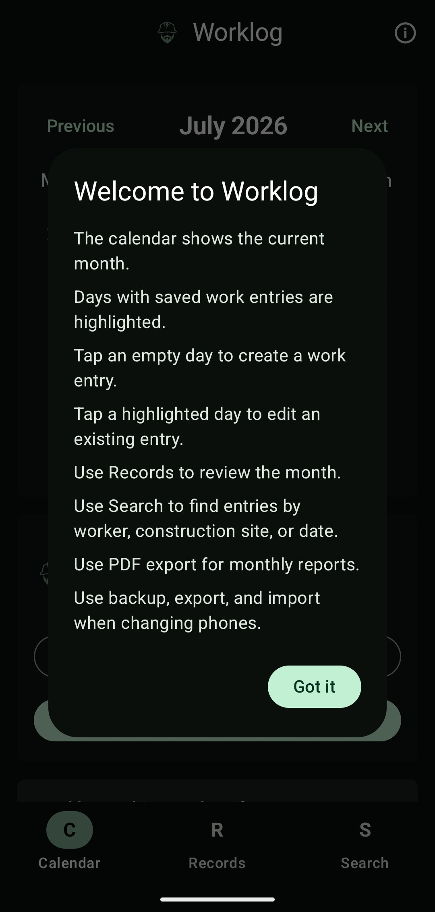
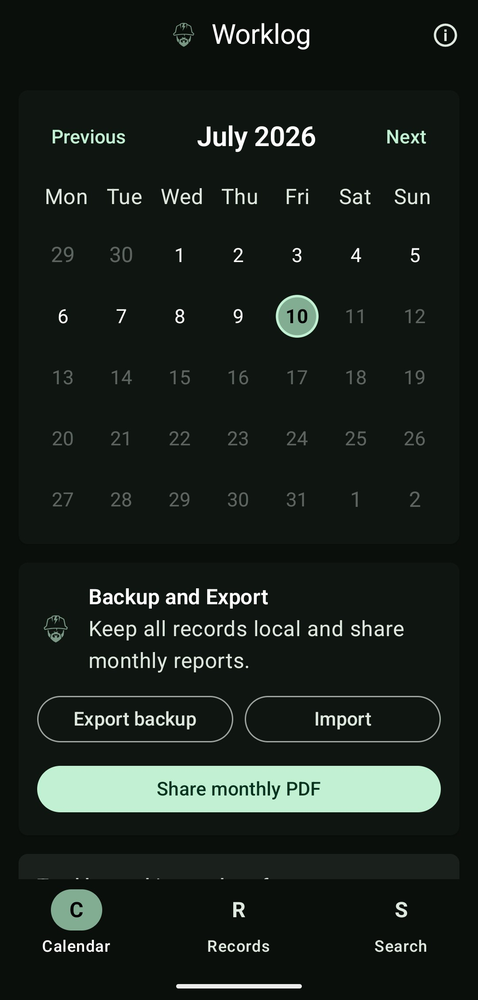
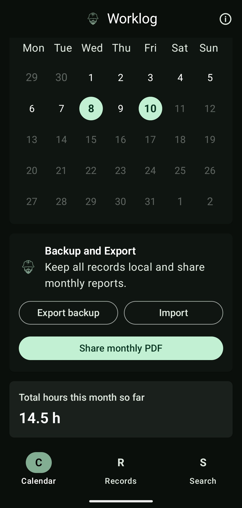
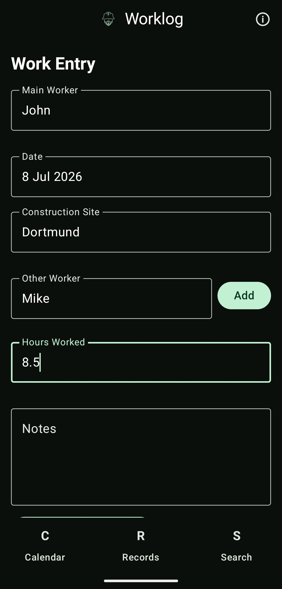
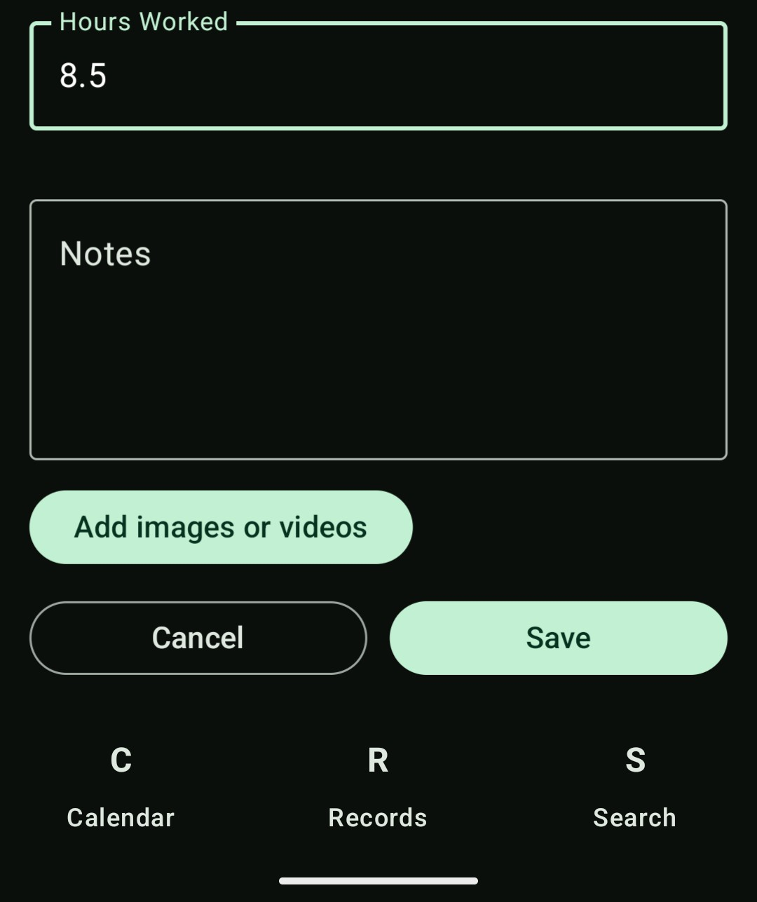
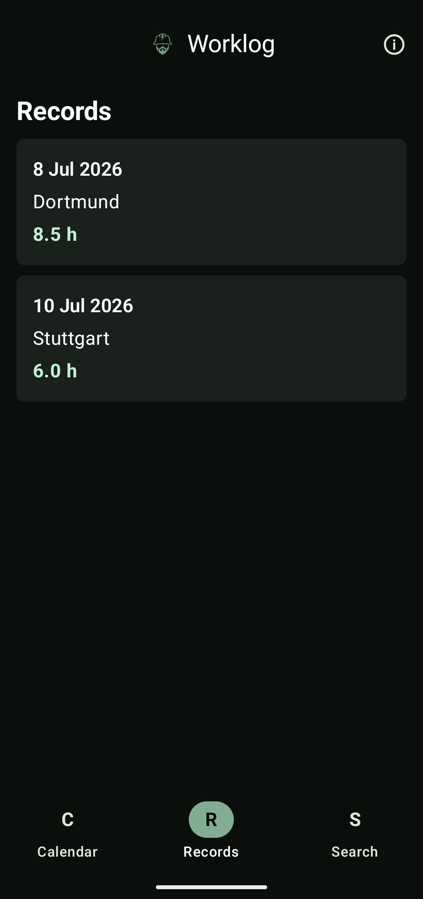
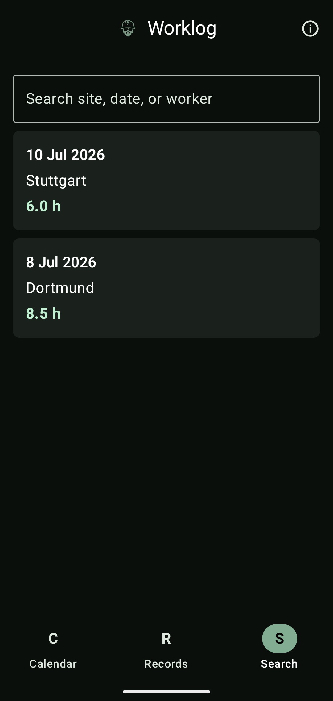
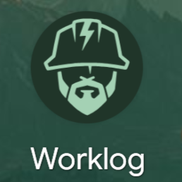
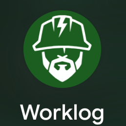

# Worklog

Worklog is an offline Android application for tracking daily construction work entries.

It is designed for construction workers, contractors, and small teams that need a simple way to record worked days, workers, construction sites, notes, monthly hours, and PDF reports.

## Features

- Monthly calendar overview
- Visual indicators for recorded work days
- Create and edit daily work entries
- Future dates are disabled
- Required field validation
- Maximum 24 working hours per day
- Main worker, construction site, other workers, and hours tracking
- Optional notes with local image and video attachments
- Records screen for monthly work entries
- Search by construction site, worker, or date
- Monthly total hours calculation
- Monthly PDF export with custom save location and filename
- Full local backup export/import
- First-launch onboarding dialog
- About dialog with GitHub link
- Material You dynamic colors
- Light and dark mode support
- Adaptive launcher icon with Android 13+ themed icon support

## Screenshots

| Welcome | Calendar | Calendar With Data |
|---|---|---|
|  |  |  |

| Add Entry | Entry Details | Records |
|---|---|---|
|  |  |  |

| Search | Material You Icon | Standard Icon |
|---|---|---|
|  |  |  |

## Tech Stack

- Kotlin
- Jetpack Compose
- Material 3
- Material You dynamic colors
- MVVM architecture
- Clean Architecture approach
- Hilt
- Room
- DataStore
- Navigation Compose
- StateFlow
- Android Storage Access Framework
- Local PDF generation

## Offline First

Worklog works completely offline.

No account, no backend, no Firebase, and no internet connection are required.  
All data stays on the user's device.

## Work Entry Data

Each work entry can contain:

- Date
- Main worker
- Construction site
- Other workers
- Worked hours
- Text notes
- Local image attachments
- Local video attachments

Only today and past dates can be edited. Future dates are disabled.

## PDF Export

Users can export monthly reports as PDF files.

The PDF contains:

- Date
- Main worker
- Construction site
- Other workers
- Worked hours
- Text notes
- Monthly total hours

Image and video attachments are stored locally but are not included in PDF reports.

The user can choose where to save the PDF and what filename to use.

## Backup and Restore

The app supports local backup export and import, allowing users to move their data to another phone.

The backup feature works completely offline.

## Build

Clone the repository:

```bash
git clone https://github.com/kole284/Worklog.git
cd Worklog
